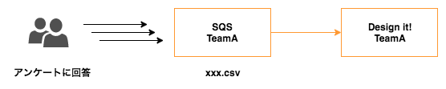
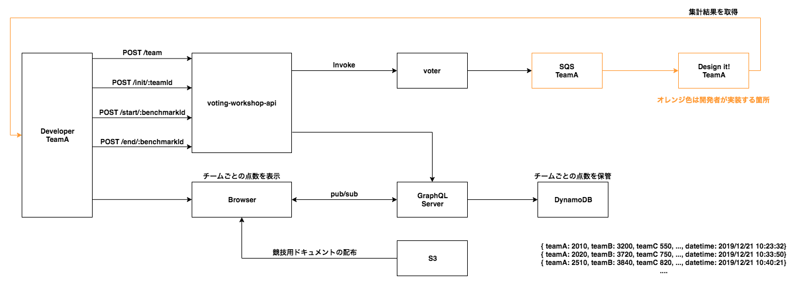

# serverless-workshop



SQS に送信された情報を集計するシステムを構築してください。

# アンケート集計システム

「冬といえば何？」というお題に対し、ユーザが回答した項目を集計してください。
CSV 形式で以下のようなファイルが SQS に格納されます。

```
1, クリスマス
2, 雪
3, こたつ
3, こたつ
8, 鍋
1, クリスマス
...
```

SQS に投入されたデータをいち早く集計し、結果をランキングごとに出力できたチームが優勝です。

| 評価項目             | ポイント                                            |
| -------------------- | --------------------------------------------------- |
| 集計までのスピード　 | （60-処理時間）分 × 100 ポイント                    |
| 集計結果の正確さ　   | 全て正解 5000 ポイント / 一位だけ正解 3000 ポイント |

# 競技用 API

競技は何度でも実行できます。１度の競技では benchmarkId を発行して benchmarkId をパラメータに与えて競技を開始します。競技が開始されると、SQS に自動的にメッセージが格納されます。SQS に格納されたメッセージを集計し、結果を集計結果 API に送信してください。

## benchmarkId 取得 API

以下の API を使用して benchmarkId を取得します。
benchmarkId は１回の競技で１度だけ使用します。

**GET** http://endpoint/init

```
{
    "benchmarkId": "c30afc91-ffd2-4407-a5ab-15b682753c0c"
}
```

## 競技開始 API

**POST** http://endpoint/start/{benchmarkId}

```
{
    "message": "benchmark job has been started.",
    "benchmarkId": "c30afc91-ffd2-4407-a5ab-15b682753c0c"
}
```

## 集計結果 API

**POST** https://endpoint/end/{benchmarkId}

HttpBody

```
{
	"ranks": [1,2,3]
}
```

Response

```
{
    "ranks": [
        1,
        2,
        3
    ],
    "score": 100
}
```


